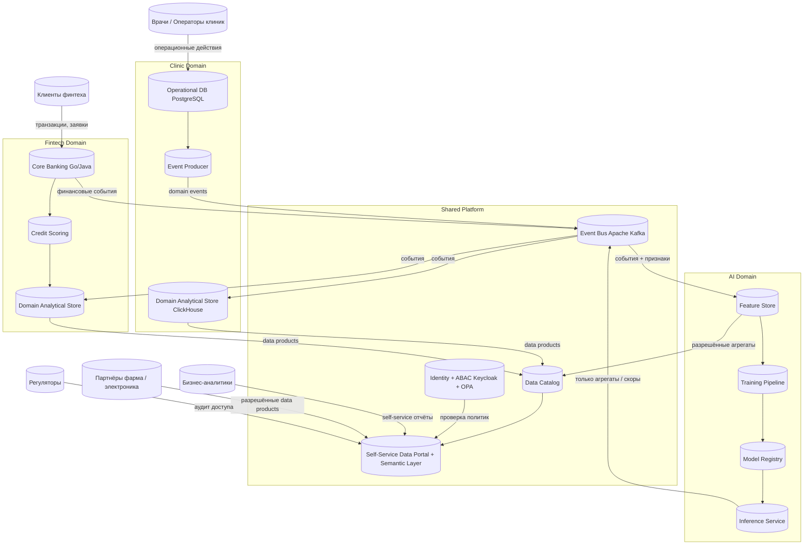

```mermaid
flowchart TB
    %% Внешние сущности
    Doctor[("Врачи / Операторы клиник")]
    Analyst[("Бизнес-аналитики")]
    FintechClient[("Клиенты финтеха")]
    Partner[("Партнёры фарма / электроника")]
    Regulator[("Регуляторы")]

    %% Домены
    subgraph Clinic["Clinic Domain"]
        ClinicOp[("Operational DB PostgreSQL")]
        ClinicDWH[("Domain Analytical Store ClickHouse")]
        ClinicEvents[("Event Producer")]
    end

    subgraph Fintech["Fintech Domain"]
        CoreBanking[("Core Banking Go/Java")]
        FintechDWH[("Domain Analytical Store")]
        Scoring[("Credit Scoring")]
    end

    subgraph AI["AI Domain"]
        FeatureStore[("Feature Store")]
        ModelRegistry[("Model Registry")]
        Inference[("Inference Service")]
        Training[("Training Pipeline")]
    end

    subgraph Platform["Shared Platform"]
        EventBus[("Event Bus Apache Kafka")]
        Catalog[("Data Catalog")]
        Identity[("Identity + ABAC Keycloak + OPA")]
        Portal[("Self-Service Data Portal + Semantic Layer")]
    end

    %% Потоки данных
    Doctor --> |операционные действия| ClinicOp
    ClinicOp --> ClinicEvents
    ClinicEvents --> |domain events| EventBus

    FintechClient --> |транзакции, заявки| CoreBanking
    CoreBanking --> |финансовые события| EventBus
    CoreBanking --> Scoring
    Scoring --> FintechDWH

    EventBus --> |события| ClinicDWH
    EventBus --> |события| FintechDWH
    EventBus --> |события + признаки| FeatureStore

    FeatureStore --> Training
    Training --> ModelRegistry
    ModelRegistry --> Inference
    Inference --> |только агрегаты / скоры| EventBus

    ClinicDWH -->|data products| Catalog
    FintechDWH -->|data products| Catalog
    FeatureStore -->|разрешённые агрегаты| Catalog

    Catalog --> Portal
    Identity --> |проверка политик| Portal

    Analyst --> |self-service отчёты| Portal
    Partner --> |разрешённые data products| Portal
    Regulator --> |аудит доступа| Portal
```
